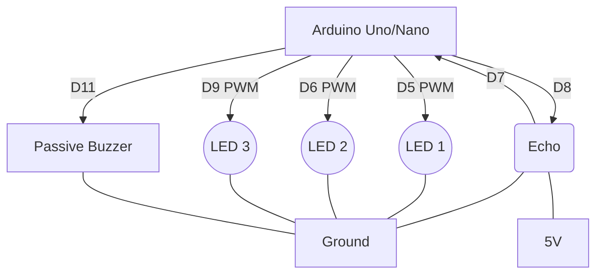

# Lumyro
Gesture Controlled Lamp

A contactless interaction lamp powered by ultrasonic sensing, EMA filtering, adaptive stability-based locking, move-to-unlock gestures, palm-cover shutdown, and proximity-based wake-up logic. All hand-driven. No switches. No buttons.

Built for reliability in real, noisy, unpredictable environments.

---

## Features

### 1. Follow Mode
The lamp continuously adjusts its brightness according to the distance of your hand. Brightness mapping is smooth and natural due to:
* Median-of-three sonar filtering
* Exponential moving average (EMA)
* Rate-limited smoothing
* Uniform LED driving

### 2. Smart Locking (Simplified Stability Model)
Hold your hand steady for 800 ms to lock the current brightness. Lock stability is determined by:
* Deviation from initial stable distance
* Noise band in the last 8 samples
* Larger but controlled stability band (4 cm)

An alternative Near-Lock activates based purely on proximity, ideal for quick 100% brightness locks.

### 3. Move-to-Unlock
If locked, move your hand approximately 3 cm away from the lock reference distance and hold for 250 ms to unlock.

### 4. Palm-Cover OFF Gesture
Bring your hand close (<= 2.8 cm) and hold for 1.2 s to turn the lamp OFF. A 2.5s ignore window prevents accidental wakeup immediately after turning off.

### 5. Distance-Based Wake System
If the lamp is OFF:
* Move hand far to arm the wake system.
* Bring hand moderately close for 400 ms to wake to FOLLOW mode.
* A post-wake lock-arm block prevents accidental instant relocking.

### 6. Smooth LED Output
Brightness changes use continuous easing for natural transitions.

### 7. Non-Blocking Buzzer Engine
Custom event-driven buzzer system provides audio feedback for Lock, Wake, and Off events without blocking the main loop.

### 8. Full Serial Logging for Debug and Tuning
Compact labeled logs provide real-time state information:
Timestamp, Distance, State (FOL, LCK, OFF), Brightness output, and Debug tags.

---

## Hardware Requirements

* HC-SR04 ultrasonic sensor
* Arduino Uno/Nano
* 3x PWM LEDs (or LED strip via MOSFETs)
* Buzzer (passive)
* Basic jumper wiring

### Pin Configuration
* TRIG: 8
* ECHO: 7
* LEDs: 5, 6, 9
* BUZZ: 11

### Circuit Diagram

---

## How It Works

### Distance Filtering
Noise-resistant sensing pipeline:
1. Median-of-3 pulse readings
2. Clamped range (2 to 20 cm)
3. EMA (Exponential Moving Average)
4. Rate-limit (max 4 cm per sample)

This produces clean signals even with jittery sonar readings.

### Hand Presence Detection
The hand is considered "present" if the distance is within the active range (not too close, not too far).

### Lock Detection
When the hand is present, the system starts a stability timer. It compares recent distance samples to check for deviation and noise. If the signal remains stable for 800ms, the system locks.

Two lock paths:
* Standard lock: Anywhere inside the usable range.
* Near-lock: If hand is very close for 700ms, instant full-brightness lock.

### Unlock Detection
In locked mode, the system detects deviation from the lock reference distance. If the deviation is >= 3 cm for >= 250 ms, the system unlocks.

### OFF Gesture
If the hand stays extremely close (<= 2.8 cm) for 1.2 seconds, the lamp shuts down and enters a brief ignore period.

### Wake From OFF
1. Detect "far region" to arm the wake system.
2. Detect moderate presence to wake the lamp.

---

## Operating Modes Summary

### FOLLOW
* Hand present: Follow brightness.
* Stability achieved: Lock.

### LOCKED
* Brightness frozen.
* Move hand significantly: Unlock.

### OFF
* Palm gesture to turn off.
* Distance-driven wake logic.

---

## Project Structure

* gesture.ino: Main logic and implementation.
* README.md: Documentation.

---

## Future Improvements

* Machine-learned gesture classification
* Auto-calibrated distance bands
* RGB fading with gesture
* BLE/IoT control
* Capacitive fallback sensing
* Multi-sensor fusion for better accuracy
